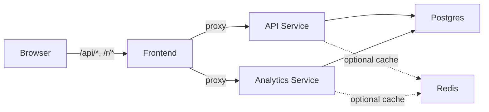

# Snip — URL Shortener

A URL shortener built with Go microservices. Also serves as an [OpenChoreo](https://github.com/openchoreo/openchoreo) sample app (manifests in [`/openchoreo`](openchoreo/)).

## Architecture

Three Go services behind a BFF (Backend-For-Frontend) proxy. The browser only makes relative requests — the frontend forwards them to backend services.



- **Frontend** — Static SPA + Go reverse proxy
- **API Service** — Shorten URLs, resolve redirects, fetch metadata
- **Analytics Service** — Click tracking and stats
- **Postgres** — `urls` and `clicks` tables
- **Redis** — Optional read-through cache (nil-safe; works without it)

## Run

```bash
docker compose up --build
```

Frontend at http://localhost:9700 | API at http://localhost:9701 | Analytics at http://localhost:9702
